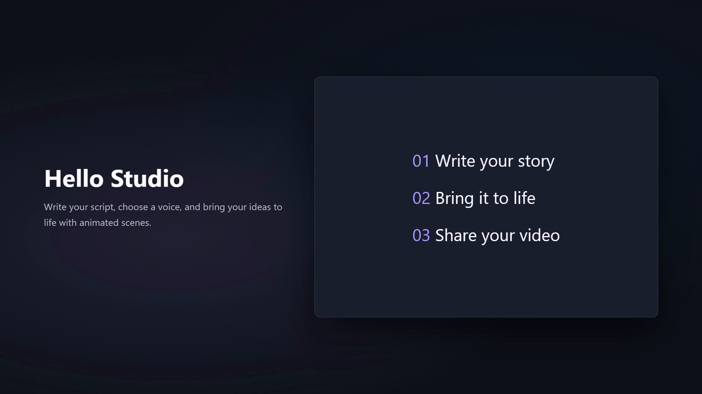

# Video Studio

Turn a Markdown script into a narrated product video with **Codex or Claude Code**. Bring screenshots or a screen recording, refine the scenes with your assistant, and export an MP4 on your own computer.

Run it locally with a browser preview, or ask your assistant to render on GitHub Actions. Publish selected videos to [the playback page](https://mrinals129-png.github.io/video-studio/). It uses HyperFrames for HTML animation and rendering, and Kokoro for speech. No video-generation API key or separate server is required.



## Get started

**Full editor in your browser:** [open a GitHub Codespace](https://codespaces.new/mrinals129-png/video-studio). It runs the same studio as localhost on a GitHub development computer. Setup and editor startup are configured automatically; see [Codespaces instructions and verification status](docs/CODESPACES.md). Codespaces uses your account's compute and storage allowance.

**Through your assistant, online:** follow [the GitHub workflow](docs/ONLINE.md). Codex or Claude Code can submit a committed script, wait for the render, and download the MP4. Publishing to Pages is optional. The public page plays finished videos; editing stays with your assistant.

**On your own computer:**

Install [Node.js 22+](https://nodejs.org/) and [Python 3.10–3.12](https://www.python.org/downloads/), then open this folder in Codex or Claude Code and ask:

> Set up Video Studio and make the sample video. Verify the export and show me the result.

Or run:

```sh
npm ci
npm run setup
npm run demo
npm run preview
```

The sample is saved to `output/hello-studio.mp4`. The preview command prints a local browser address. Initial setup downloads the speech libraries and roughly 120 MB of model files; rendering may also download a Chromium browser. Dependencies stay local to this project.

On Windows, use `npm.cmd` if PowerShell blocks `npm`. The same commands are intended for Windows, macOS, and Linux; see [verification notes](docs/VERIFICATION.md) for platforms actually tested.

## Make your own

Copy [SCRIPT-TEMPLATE.md](SCRIPT-TEMPLATE.md) to `scripts/my-feature.md`, fill it in, then ask your assistant:

> Make a video from scripts/my-feature.md. Use my screenshot in assets/screenshot.png, check the narration and scenes, and export an MP4.

See the [workflow](docs/WORKFLOW.md) for recordings, voice selection, editing, and troubleshooting. [Ready-to-use prompts](prompts/start-a-video.md) are included.

## What is included

- Native project instructions and video skills for Codex and Claude Code.
- Local narration, reusable HTML scenes, and editable brand colors.
- Screenshot and recording support, plus an advanced overlay template.
- A browser timeline preview and MP4 export.
- Repeatable setup, automated checks, and export verification.

Scripts live in `scripts/`, personal media in `assets/`, editable scenes in `compositions/`, and exports in `output/`. Models and generated/personal media are ignored by Git. Change `_engine/templates/brand.css` to set your visual identity.

Word timestamps are estimated, so captions and scene timing need listening review. Complex animation requests are implemented by the assistant in HTML; the generator itself provides a starting composition.

## Development

```sh
npm test
npm run doctor
npm run studio -- --help
```

Read [AGENTS.md](AGENTS.md) for contributor guidance. The studio source is [MIT licensed](LICENSE). Dependencies have their own licenses; see [THIRD-PARTY-NOTICES.md](THIRD-PARTY-NOTICES.md). The original work-specific examples and conversation exports are not part of this repository.
